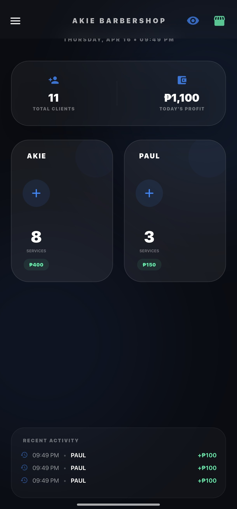
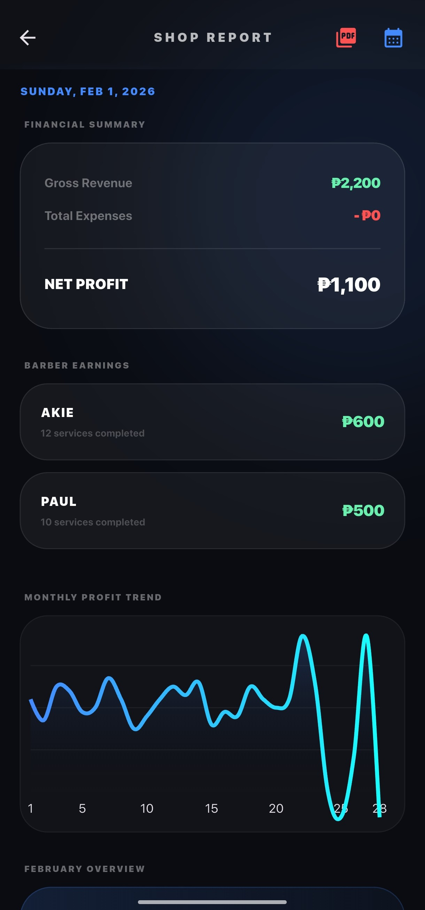
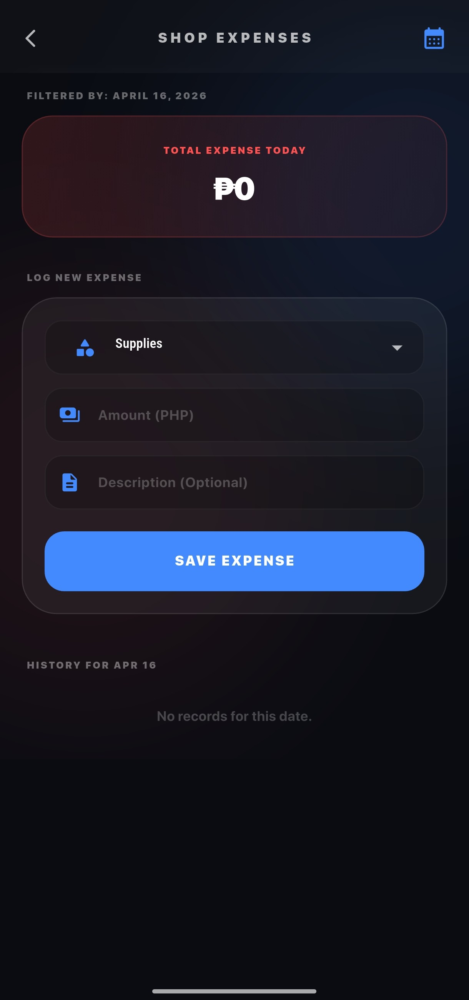
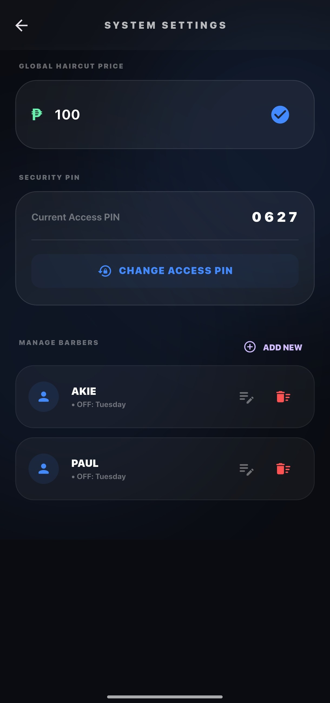

# 💈 Akie Barbershop


**Akie Barbershop** is a sleek, modern mobile application built with Flutter. Designed to streamline barbershop operations, it features a premium dark-themed user interface, comprehensive state management, dynamic data visualization, and a scalable Supabase backend.

---

## 📑 Table of Contents
- [Features](#-features)
- [Screenshots](#-screenshots)
- [Tech Stack](#-tech-stack)
- [Project Architecture](#-project-architecture)
- [Getting Started](#-getting-started)
- [Configuration](#-configuration)
- [Contributing](#-contributing)
- [License](#-license)

---

## ✨ Features

- **Premium UI/UX:** A sophisticated dark-mode interface (`#0F111A`) utilizing iOS typography (San Francisco) and smooth Cupertino page transitions.
- **Backend as a Service (BaaS):** Seamless integration with **Supabase** for secure real-time database operations and user authentication.
- **State Management:** Efficient and scalable state management utilizing the **Provider** package.
- **Data Visualization:** Interactive charts and shop statistics powered by `fl_chart`.
- **Report Generation:** Generate, export, and print PDF reports directly from the app using the `pdf` and `printing` packages.

---
## 📱 Screenshots

| Landing Pages | Dashboards | Analytics | Expenses & Settings |
| :---: | :---: | :---: | :---: |
|  |  |  |  |
|  |  |  |  |

---

## 🛠️ Tech Stack 

- **Framework:** [Flutter](https://flutter.dev/) (SDK `^3.11.0`)
- **Language:** Dart
- **Backend:** `supabase_flutter` (`^2.0.0`)
- **State Management:** `provider` (`^6.1.1`)
- **Charting:** `fl_chart` (`^1.1.1`)
- **PDF & Printing:** `pdf` (`^3.10.0`), `printing` (`^5.11.0`)
- **Utilities:** `intl` (`^0.19.0`), `path_provider` (`^2.1.1`)

---

## 🏗️ Project Architecture

The application follows a clean, modular directory structure:

```text
lib/
│
├── models/             # Data models (e.g., Barber, Expense)
├── providers/          # State management (e.g., CounterProvider)
├── screens/            # UI Views
│   ├── landing_page.dart
│   ├── login_screen.dart
│   ├── counter_screen.dart
│   ├── analytics_screen.dart
│   └── expense_screen.dart
│
├── services/           # External API & utility services (e.g., PDF export)
├── utils/              # Helper functions and formatters
└── main.dart           # App entry point and routing
